# Arteries
Arteries is a procedural modeling toolkit base on UE4 blueprint. By using this plugin you can implement the whole modeling procedure in UE4 blueprint graph without any other modeling software.\
To implement a modeling procedure is rather simple. Just creating a blueprint inherited from ArteriesActor and implement its OnBuild event. In the event graph you can create a serial of different geometry operation nodes and any logic you want to build the final geometry.

### Features
- Runtime generation.
- Multi-threaded.
- Most of common geometry operations.
- Per Point/Primitive/Geometry lua code snippet for custom operations.
- Point/Primitive group.
- Point/Primitive custom attributes.
- Tangent space and UV coordinates generation.
- Procedural static mesh instancing.
- Full source code provided.

### Links
- [Showcase videos](https://www.youtube.com/watch?v=zkpzxiqoXaU&list=PLCWhWOgVmdwmC1AvcIOw95H3lHI3wF6mG)
- [Roadmap](https://trello.com/b/SZbZi3Rd/arteries)
- [Support link](https://forums.unrealengine.com/community/work-in-progress/1637829-houdini-alternative-a-procedural-modeling-toolkit-based-on-blueprint)
- [Marketplace link](https://www.unrealengine.com/marketplace/en-US/slug)

## Documentation

- [1. The modeling procedure](#1-the-modeling-procedure)
  - [Your first modeling procedure](#your-first-modeling-procedure)
  - [Check each steps](#check-each-steps)
  - [Place static meshes](#place-static-meshes)
  - [Multi-thread](#multi-thread)
  - [Spawn sub actors](#spawn-sub-actors)
- [2. The extended blueprint editor](#2-the-extended-blueprint-editor)
- [3. BP callable functions](#3-bp-callable-functions)
  - [Basic Primitives](#basic-primitives)
  - [Copy and Transforms](#copy-and-transforms)
  - [Attributes And Groups](#attributes-and-groups)
  - [Lua Script](#lua-script)
  - [Geometry Operations](#geometry-operations)
- [4. Lua callable functions](#4-lua-callable-functions)
	- [BP Properties (Global)](#bp-properties-global)
	- [Element (Point, Primitive, Geometry) Properties](#element-point-primitive-geometry-properties)
	- [Point](#point)
	- [Primitive](#primitive)
	- [Geometry](#geometry)

### 1. The modeling procedure
#### Your first modeling procedure
<table>
<tr>
<td>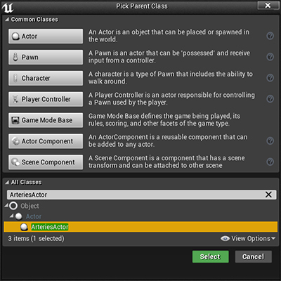</td>
<td>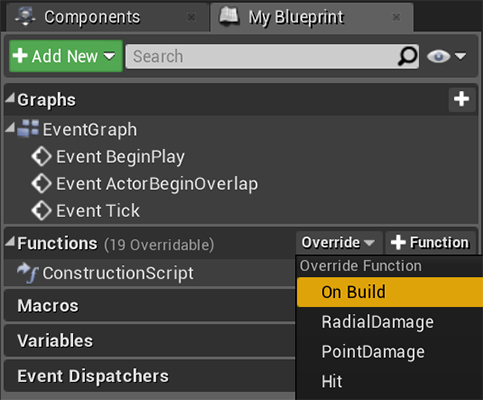</td>
</tr>
<tr>
<td>1) Creating a blueprint inherited from ArteriesActor.</td>
<td>2) Implement its OnBuild event.</td>
</tr>
<tr>
<td colspan="2">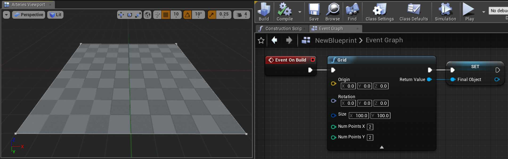</td>
</tr>
<tr>
<td colspan="2">3) Finish the implementation then click compile and build button.</td>
</tr>
</table>
For usages of more geometry operation nodes and in-depth tutorials please see the tutorial playlist

\

#### Check each steps
The final result will be displayed in Arteries Viewport after you click build button. Sometimes it's also neccessary to check the result of each steps. You can display results of any selected geometry operation nodes using Arteries extended functions in context menu or just press "D" key.

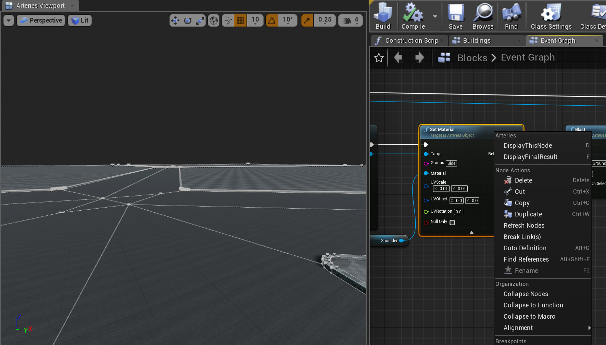

#### Place static meshes
\
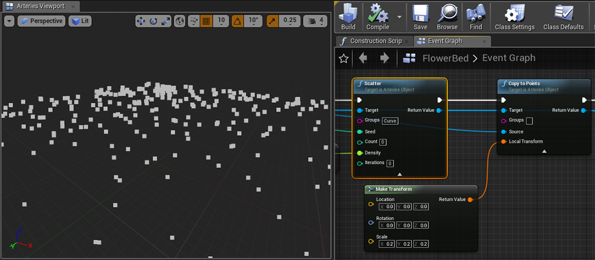

a) Scatter node creates points inside specific primitives randomly.

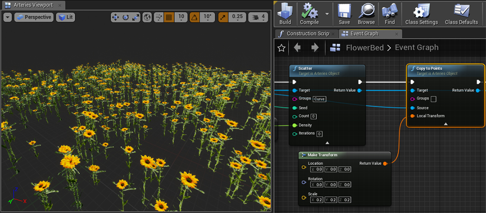

b) CopyToPoints node copies a staticmesh to points created by previous node. A HierarchicalInstancedStaticMeshComponent attached to the final actor will be created for each static mesh.

#### Multi-thread
Arteries is designed for multi-threaded to improve generation performance. There are 2 threads for each Arteries actor in the process of generation. One for calling OnBuild event and another is a task queue to process all Completed event of all sub actors.

#### Spawn sub actors

In modeling procedure you can spawn other Arteries actors then attach them to current actor as children or merge geometries generated by them to a new geometry for further operations.\
In order to support multi-thread generation please use SpawnActorAsync instead of SpawnActorFromClass.

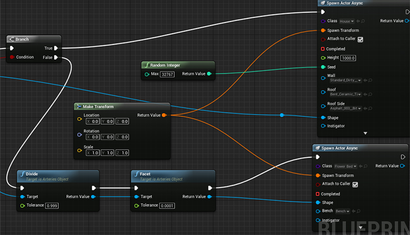

a) If you don't need to process the final geometry of the spawned actor, just want it to be attached as child actor, please set "Attach to Caller" to true and leave Completed event unbind.

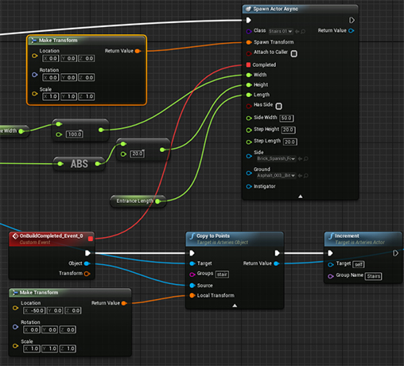

b) If you set "Attach to Caller" to false, this spawned actor will be destroyed after current actor finish its generation. So you should bind Completed event of spawned actor and make sure its geometry (ArteriesObject) has been merged to the geometry of current actor.

### 2. The extended blueprint editor
Arteries extends blueprint editor for its specific functions. You could always find the two extended windows in window menu.\
Arteries Viewport works just like original viewport in addition to Arteries specific functions for selection and editing. Don't forget to close the original viewport otherwise it will be very slow due to redundant rendering. Although most of geometries (ArteriesObject) are generated by procedure, manual editing is still neccessary for profile curves and some initial shapes.

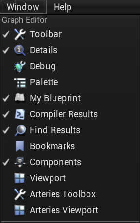|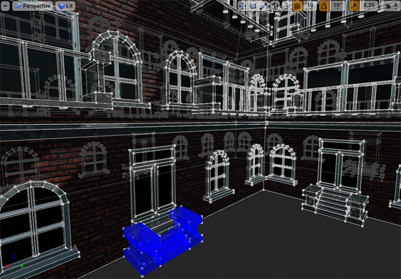
:-:|:-:
a) Arteries extended windows.|b) Arteries Viewport.

In Arteries Toolbox there are 5 tabs covering editing modes, statistics and settings.

- Select Mode
>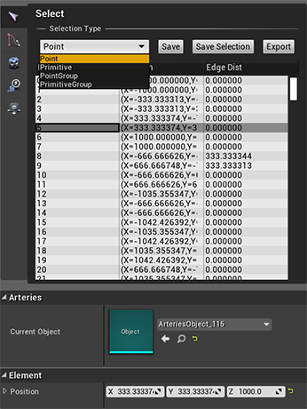\
\
There are 4 selection types in this mode. You can select elements by clicking them in Arteries Viewport or just in the property sheet.\
You can also modify properties of current selected elements in the property editor on bottom of the toolbox.

- Create Mode
>In this mode you can create primitive by drawing lines in the viewport.

- Settings
>In this page you can modify some settings of the editor.

- Statistics
>In this page you can see some statistics of building process.

- Internal Objects
>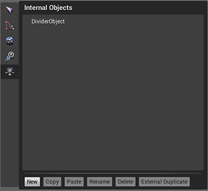\
\
Some manually created geometry used by the modeling procedure internally should be saved in the same package of the blueprint for the sake of assets management.

### 3. BP callable functions
#### Basic Primitives
- Line
- Grid
- Circle
- Sphere
- Tube
- Torus
- Box

#### Copy and Transforms
- Add
- Copy
- CopyAndTransform
- CopyToPoints
- Transform
- Merge
- MergeArray

#### Attributes And Groups
- SortRandomly
- SortByAttribute
- GroupRange
- Measure
- Hole
- SetMaterial

#### Lua Script
- Execute

#### Geometry Operations
- Carve
- BreakPoints
- Scatter
- Voronoi
- SubDivide
- Blast
- Facet
- Divide
- Fuse
- Clean
- MakeGrids
- PolyExpand
- Clip
- Resample
- Reverse
- PolyBevel
- PolyExtrude
- Sweep

### 4. Lua callable functions
#### BP Properties (Global)
- GetInt
- GetFloat
- GetVec2
- GetVec3

#### Element (Point, Primitive, Geometry) Properties
- HasInt
- GetInt
- SetInt
- HasFloat
- GetFloat
- SetFloat
- HasVec3
- GetVec3
- SetVec3

#### Point
- Position (Property)
- GetTargets
- GetPrimitives

#### Primitive
- Insert
- Add
- NumPoints
- GetPoint
- Delete

#### Geometry
- AddPoint
- AddPrimitive
- NumPoints
- NumPrimitives
- GetPoint
- GetPrimitive
- DeletePoint
- DeletePrimitive
- SetPointGroup
- SetPrimitiveGroup
