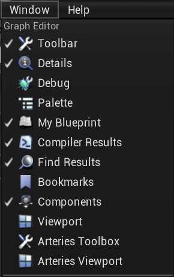

# Arteries
Arteries is a procedural modeling toolkit base on UE4 blueprint. By using this plugin you can implement the whole modeling procedure in UE4 blueprint graph without any other modeling software.\
To implement a modeling procedure is rather simple. Just creating a blueprint inherited from ArteriesActor and implement its OnBuild event. In the event graph you can create a serial of different geometry operation nodes and any logic you want to build the final geometry.

### Features
- Runtime procedural generation.
- Multi-threaded.
- Most of common geometry operations.
- Per Point/Primitive/Geometry lua code snippet for custom operations.
- Point/Primitive group.
- Point/Primitive custom attributes.
- Tangent space and UV coordinates generation.
- Static mesh instancing during placement.
- Full source code provided.

### Links
- [Marketplace link](https://www.unrealengine.com/marketplace/en-US/slug)
- [Video link](https://www.unrealengine.com/marketplace/en-US/slug)
- [Support link](https://forums.unrealengine.com/community/work-in-progress/1637829-houdini-alternative-a-procedural-modeling-toolkit-based-on-blueprint)
- [Roadmap link](https://trello.com/b/SZbZi3Rd/arteries)

## Documentation

### 1. Blueprint Editor
|
-|-
test111|test222

Arteries extends blueprint editor for its specific functions.

### 2. Multi-threaded

### 3. BP callable functions
#### Basic Primitives
- Line
- Grid
- Circle
- Sphere
- Tube
- Torus
- Box

#### Copy and Transforms
- Add
- Copy
- CopyAndTransform
- CopyToPoints
- Transform
- Merge
- MergeArray

#### Attributes And Groups
- SortRandomly
- SortByAttribute
- GroupRange
- Measure
- Hole
- SetMaterial

#### Lua Script
- Execute

#### Geometry Operations
- Carve
- BreakPoints
- Scatter
- Voronoi
- SubDivide
- Blast
- Facet
- Divide
- Fuse
- Clean
- MakeGrids
- PolyExpand
- Clip
- Resample
- Reverse
- PolyBevel
- PolyExtrude
- Sweep

### 4. Lua callable functions
#### BP Properties (Global)
- GetInt
- GetFloat
- GetVec2
- GetVec3
#### Element (Point, Primitive, Geometry) Properties
- HasInt
- GetInt
- SetInt
- HasFloat
- GetFloat
- SetFloat
- HasVec3
- GetVec3
- SetVec3
#### Point
- Position (Property)
- GetTargets
- GetPrimitives
#### Primitive
- Insert
- Add
- NumPoints
- GetPoint
- Delete
#### Geometry
- AddPoint
- AddPrimitive
- NumPoints
- NumPrimitives
- GetPoint
- GetPrimitive
- DeletePoint
- DeletePrimitive
- SetPointGroup
- SetPrimitiveGroup
