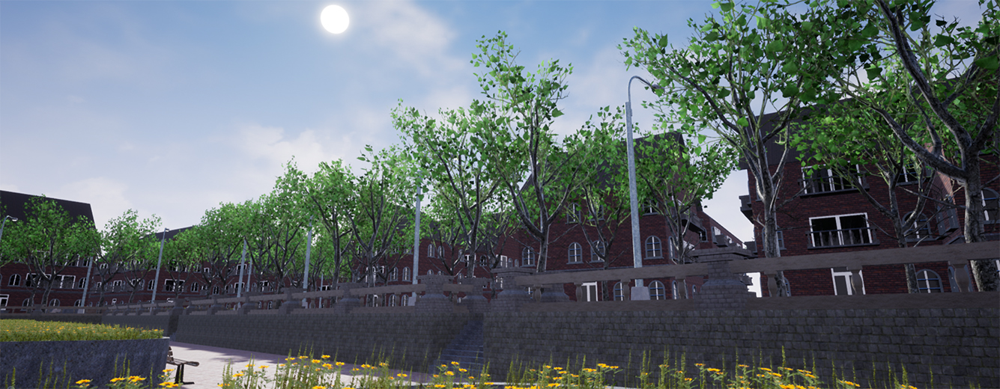

# Arteries
Arteries is a procedural modeling toolkit base on UE4 blueprint. By using this plugin you can implement the whole modeling procedure in UE4 blueprint graph without any other modeling software.\
To implement a modeling procedure is rather simple. Just creating a blueprint inherited from ArteriesActor and implement its OnBuild event. In the event graph you can create a serial of different geometry operation nodes and any logic you want to build the final geometry.

### Features
- Runtime generation.
- Multi-threaded.
- Most of common geometry operations.
- Per Point/Primitive/Geometry lua code snippet for custom operations.
- Point/Primitive group.
- Point/Primitive custom attributes.
- Tangent space and UV coordinates generation.
- Static mesh instancing during placement.
- Full source code provided.

### Links
- [Marketplace link](https://www.unrealengine.com/marketplace/en-US/slug)
- [Video link](https://www.youtube.com/watch?v=zkpzxiqoXaU&list=PLCWhWOgVmdwmC1AvcIOw95H3lHI3wF6mG)
- [Support link](https://forums.unrealengine.com/community/work-in-progress/1637829-houdini-alternative-a-procedural-modeling-toolkit-based-on-blueprint)
- [Roadmap link](https://trello.com/b/SZbZi3Rd/arteries)

## Documentation

### 1. The modeling procedure
#### Your first modeling procedure
<table>
<tr>
<td></td>
<td></td>
</tr>
<tr>
<td>a) Creating a blueprint inherited from ArteriesActor.</td>
<td>b) Implement its OnBuild event.</td>
</tr>
<tr>
<td colspan="2"></td>
</tr>
<tr>
<td colspan="2">c) Finish the implementation then click compile and build button.</td>
</tr>
</table>

### 2. The extended blueprint editor
Arteries extends blueprint editor for its specific functions. You could always find the two extended windows in window menu.\
Arteries Viewport works just like original viewport in addition to Arteries specific functions for selection and editing. Although most of geometries (ArteriesObject) are generated by procedure, manual editing is still neccessary for profile curves and some initial shapes.

|
:-:|:-:
a) Two extended windows in the menu.|b) Arteries Viewport.

In Arteries Toolbox there are 5 tabs covering editing modes, statistics and settings.

- Select Mode
>\
\
There are 4 selection types in this mode. You can select elements by clicking them in Arteries Viewport or just in the property sheet.\
You can also modify properties of current selected elements in the property editor on bottom of the toolbox.

- Create Mode
>In this mode you can create primitive by drawing lines in the viewport.

- Settings
>In this page you can modify some settings of the editor.

- Statistics
>In this page you can see some statistics of building process.

- Internal Objects
>\
\
Some manually created geometry used by the modeling procedure internally should be saved in the same package of the blueprint for the sake of assets management.

aaaa

### 3. BP callable functions
#### Basic Primitives
- Line
- Grid
- Circle
- Sphere
- Tube
- Torus
- Box

#### Copy and Transforms
- Add
- Copy
- CopyAndTransform
- CopyToPoints
- Transform
- Merge
- MergeArray

#### Attributes And Groups
- SortRandomly
- SortByAttribute
- GroupRange
- Measure
- Hole
- SetMaterial

#### Lua Script
- Execute

#### Geometry Operations
- Carve
- BreakPoints
- Scatter
- Voronoi
- SubDivide
- Blast
- Facet
- Divide
- Fuse
- Clean
- MakeGrids
- PolyExpand
- Clip
- Resample
- Reverse
- PolyBevel
- PolyExtrude
- Sweep

### 4. Lua callable functions
#### BP Properties (Global)
- GetInt
- GetFloat
- GetVec2
- GetVec3
#### Element (Point, Primitive, Geometry) Properties
- HasInt
- GetInt
- SetInt
- HasFloat
- GetFloat
- SetFloat
- HasVec3
- GetVec3
- SetVec3
#### Point
- Position (Property)
- GetTargets
- GetPrimitives
#### Primitive
- Insert
- Add
- NumPoints
- GetPoint
- Delete
#### Geometry
- AddPoint
- AddPrimitive
- NumPoints
- NumPrimitives
- GetPoint
- GetPrimitive
- DeletePoint
- DeletePrimitive
- SetPointGroup
- SetPrimitiveGroup
